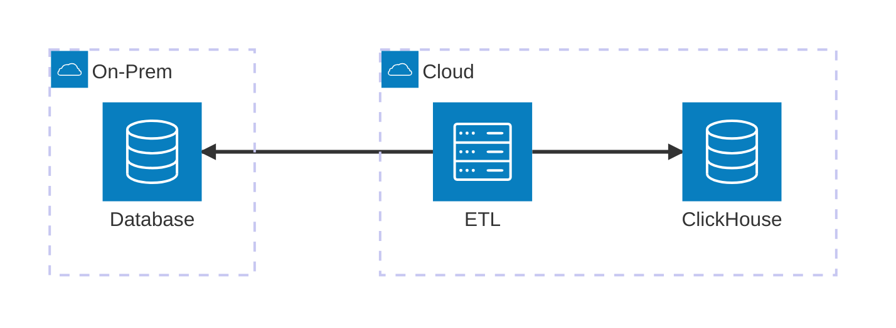
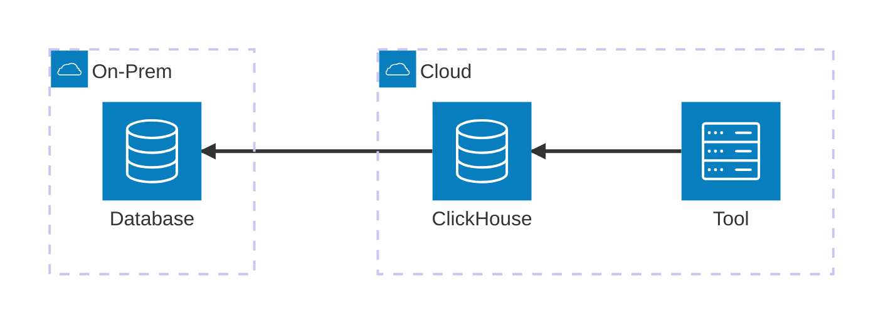

import { html } from "htl";
import Plot from "../../components/Plot.tsx";

import {
    writeThroughput,
    insertionTime,
    readThroughput,
    queryTime,
    timescaleQueryBreakdown,
} from "./_data/gigawatt-columndb-eval.ts";

In September 2025, I started working at [Gigawatt AI][]. Being one of the first engineers onboard, I had a pretty big
hand in shaping the developer experience. After building our initial prototype, I shifted over to more devops focused
tasks. While less glamorous, we needed this work to load customer data into our system. This involved setting up VPN
connections and wiring up data replication paths. Eventually, this led me to working on building out our meter data
ingestion pipeline. In this post, I share how we evaluated several open-source and hosted solutions for storing utility
meter data.

[Gigawatt AI]: https://gigawatt.ai/

_First, some context..._

Utility meters tend to come in two flavors. Traditional meters need technicians to drive around and take readings
manually. Smart meters automatically emit readings over common cellular or LoRa (long range) networks. Each individual
reading contains a small amount of information. However, this information adds up fast. A small municipality may contain
several million meters emitting information every 15 minutes.

Next, we can start to establish service level objectives (SLOs) that our meter data store must meet. Unlike many SaaS
solutions, this traffic doesn't fluctuate with daytime and evening hours. Since meters emit information all the time, we
need to **support 99.99% uptime** (~5min per month, ~1hr per year). Using several estimates, we determined the system
must support **10k writes per second**. Durable queues like [Apache Kafka][] will help buffer incoming writes and
mitigate downtime. However, our data store still needs to be able to process requests at a high rate in the event it
needs to catch up. Additionally, queries against the system should return **under 200ms**. This ensures utility
customers and support representatives are able to answer questions quickly.

In addition to sporting some aggressive SLO's, we also need to be aware of several risks that this system may face. For
instance, it's possible for utility meter data to arrive out of order. While most systems are capable of handling such
an insertion, it typically comes at a cost. Minimizing this cost will help keep the system running in a performant way.
Due to the high number of writes, we also need to mitigate write amplification. This happens when a system undergoes a
large number of writes or updates to records resulting in significantly higher storage costs.

[Apache Kafka]: https://kafka.apache.org/

_Solution Space_

The "big-data" landscape is fairly vast these days. We narrowed our evaluation down to four primary solutions, each
differing in their performance characteristics and operational needs. We selected the following technologies based on
past experiences, alignment with our current technologies, and their flexibility to support different integrations.

[Apache Cassandra][] is an open-source, highly distributed NoSQL database designed to handle massive amounts of data
across multiple availability zones with no single point of failure. It utilizes a masterless, peer-to-peer architecture
where all nodes in a cluster are equal, ensuring continuous availability and fault tolerance even during hardware
failures.

[ClickHouse][] is an open-source, column-oriented SQL database management system engineered specifically for real-time
Online Analytical Processing (OLAP) at petabyte scale. Unlike traditional row-oriented databases, ClickHouse stores data
by columns and leverages advanced data compression and vectorized query execution to scan billions of rows per second
with incredibly low latency.

[Apache Iceberg][] is a high-performance, open-source table format designed for massive analytical datasets stored in
data lakes and lakehouse architectures. By decoupling a table's logical definition from its physical file paths through
a robust three-layer metadata architecture, Iceberg brings the reliability and simplicity of traditional SQL tables to
object storage (like AWS S3).

[TimescaleDB][] is an open-source relational database engineered specifically for time-series and event data, built as a
powerful extension of PostgreSQL. It provides the "best of both worlds" by combining the rich ecosystem, reliability,
and full SQL support of a traditional relational database with the specialized performance optimizations required for
massive influxes of timestamped data.

If you've read any of my work, seen me speak, or met me, you may argue that I have a bias towards ClickHouse here (and
you wouldn't be wrong...). During this evaluation it was paramount for me to check this bias at the door. I needed to
allow the various system's performance to speak for itself. I have a fairly long history of being a ClickHouse user and
its surrounding ecosystem so I know more of the finer points when it comes to scaling this infrastructure.

[Apache Cassandra]: https://cassandra.apache.org/doc/latest/cassandra/architecture/overview.html
[ClickHouse]: https://clickhouse.com/clickhouse
[Apache Iceberg]: https://www.confluent.io/learn/what-is-apache-iceberg/
[TimescaleDB]: https://www.gartner.com/reviews/product/timescaledb

_Developing the Harness_

Building out and testing our harness was arguably one of the easier tasks in this assignment. With the proper guidance,
detailed code review, and feedback, I was able to work with Claude Code to scaffold out a proof of concept repository
capable of testing each solution in a consistent manner. While there were points where we required some implementation
specific considerations, we tried to keep the operations, simulations, and reporting consistent across the board.

For simplicity, we leveraged Podman to spin up each stack independently of one another. We tested this outside cloud
environments as we assumed data replication between availability zones would be consistent or negligible regardless of
the solution. Doing so allowed us to focus on the core performance of the underlying technology and rule out any network
issues that may arise. Simulations were recorded to a JSON file and later aggregated for reporting.

The simulations we ran were as follows:

| Simulation                 | Description                                                                                                                                |
| :------------------------- | :----------------------------------------------------------------------------------------------------------------------------------------- |
| `ingest-baseline`          | Writes batches of 10k records across 8 workers for at least 1 min and the solution inserted 500k records.                                  |
| `ingest-batch-sweep`       | Tests write throughput against batch size (1k, 5k, 10k, 50k, 100k records per batch).                                                      |
| `ingest-concurrency-sweep` | Tests write throughput against writer parallelism (1, 4, 8, 16, 32 writers).                                                               |
| `query-scenarios`          | Queries for single meter read, operating company aggregation, batch lookup for auditing, and full version history.                         |
| `mixed-workload`           | Performs concurrent ingest and query operations to ensure the system properly handles mixed workloads and not just high-performance silos. |
| `fault-tolerance`          | Kills and restarts a data node during ingestion.                                                                                           |
| `scale-up-rebalance`       | Adds a new data node to the cluster.                                                                                                       |
| `storage-efficiency`       | Computes compression ratio, bytes / row, and bytes on disk.                                                                                |

_Running Simulations_

Once we verified our simulations worked as expected, we began running them against each stack using the same consistent
workflow, as well as a freshly provisioned VM with 8 CPU and 16Gi of memory.

1. Spin up the stack using `podman compose up`
2. Wait for services to report healthy
3. Begin simulations (usually with a `make` target)
4. Clean up using `podman compose down -v`

If we encountered a bug while running simulations, we would scrap all existing results, patch the bug, and restart them
to ensure our test results used the same software version. Once we had results for each technology, we aggregated them
into a CSV and imported them into Google Sheets for further analysis. We started by digging into the write performance
for each solution.

<Plot
    client:only="preact"
    ariaLabel="Write Throughput"
    options={{
        title: "Write Throughput",
        height: 340,
        marginLeft: 60,
        x: { axis: null, padding: 0.1 },
        fx: { label: "Platform" },
        y: { label: "writes/s", grid: true },
        color: {
            legend: true,
            domain: ["min", "median", "max"],
        },
    }}
    marks={[
        {
            type: "barY",
            data: writeThroughput,
            options: { fx: "platform", x: "metric", y: "wps", fill: "metric" },
        },
        {
            type: "text",
            data: writeThroughput,
            options: {
                fx: "platform",
                x: "metric",
                y: "wps",
                text: "wps",
                textAnchor: "middle",
                dy: -6,
            },
        },
        { type: "ruleY", data: [0] },
    ]}
/>

<Plot
    client:only="preact"
    ariaLabel="Insertion Time"
    options={{
        title: "Insertion Time",
        height: 340,
        marginLeft: 60,
        x: { axis: null, padding: 0.1 },
        fx: { label: "Platform" },
        y: { label: "ms", grid: true },
        color: {
            legend: true,
            domain: ["median", "p95", "p99"],
        },
    }}
    marks={[
        {
            type: "barY",
            data: insertionTime,
            options: { fx: "platform", x: "metric", y: "ms", fill: "metric" },
        },
        {
            type: "text",
            data: insertionTime,
            options: {
                fx: "platform",
                x: "metric",
                y: "ms",
                text: "ms",
                textAnchor: "middle",
                dy: -6,
            },
        },
        { type: "ruleY", data: [0] },
    ]}
/>

After an initial round of testing, we were quite surprised by just how many more records ClickHouse was capable of
inserting, and just how fast they were performing inserts. After doing some research, we discovered that operations
against a ClickHouse cluster are performed asynchronously\*. This allows ClickHouse to ingest data at a significantly
higher rate and reduce the possibility of write-amplification from happening during a narrow window of time. After
evaluating the write and read performance, we started to look at queries.

<Plot
    client:only="preact"
    ariaLabel="Read Throughput"
    options={{
        title: "Read Throughput",
        height: 340,
        marginLeft: 60,
        x: { axis: null, padding: 0.1 },
        fx: { label: "Platform" },
        y: { label: "qeuries/s", grid: true },
        color: {
            legend: true,
            domain: ["min", "median", "max"],
        },
    }}
    marks={[
        {
            type: "barY",
            data: readThroughput,
            options: { fx: "platform", x: "metric", y: "qps", fill: "metric" },
        },
        {
            type: "text",
            data: readThroughput,
            options: {
                fx: "platform",
                x: "metric",
                y: "qps",
                text: "qps",
                textAnchor: "middle",
                dy: -6,
            },
        },
        { type: "ruleY", data: [0] },
    ]}
/>

<Plot
    client:only="preact"
    ariaLabel="Query Time"
    options={{
        title: "Query Time",
        height: 340,
        marginLeft: 60,
        x: { axis: null, padding: 0.1 },
        fx: { label: "Platform" },
        y: { label: "ms", grid: true },
        color: {
            legend: true,
            domain: ["median", "p95", "p99"],
        },
    }}
    marks={[
        {
            type: "barY",
            data: queryTime,
            options: { fx: "platform", x: "metric", y: "ms", fill: "metric" },
        },
        {
            type: "text",
            data: queryTime,
            options: {
                fx: "platform",
                x: "metric",
                y: "ms",
                text: "ms",
                textAnchor: "middle",
                dy: -6,
            },
        },
        { type: "ruleY", data: [0] },
    ]}
/>

ClickHouse and Iceberg offered a fairly predictable performance curve for queries. Digging deeper into Cassandra's read
throughput, we can see it drop due to poor performance on our batch audit query, likely due to a missing index.
TimescaleDB missed both our batch audit and opco aggregation queries, resulting in the large variance we see above. You
can see a breakdown of each query in the chart below.

<Plot
    client:only="preact"
    ariaLabel="TimescaleDB Query Breakdown"
    options={{
        title: "TimescaleDB Query Breakdown",
        height: 340,
        marginLeft: 60,
        x: { axis: null, padding: 0.1 },
        fx: { label: "Scenario" },
        y: { label: "ms", grid: true },
        color: {
            legend: true,
            domain: ["median", "p95", "p99"],
        },
    }}
    marks={[
        {
            type: "barY",
            data: timescaleQueryBreakdown,
            options: { fx: "scenario", x: "metric", y: "ms", fill: "metric" },
        },
        {
            type: "text",
            data: timescaleQueryBreakdown,
            options: {
                fx: "scenario",
                x: "metric",
                y: "ms",
                text: "ms",
                textAnchor: "middle",
                dy: -6,
            },
        },
        { type: "ruleY", data: [0] },
    ]}
/>

After all of our testing, we found that ClickHouse supported the most optimal write path, even with synchronous writes
enabled. Cassandra sported the best read-performance, but would struggle to keep up in the event that we needed to
double traffic to the system. In order to store the totality of information, TimescaleDB and Cassandra both required
large disks to be provisioned. ClickHouse and Iceberg are capable of offloading their data into object stores like AWS
S3, a significantly cheaper form of storage. Taking all of this information into account, we decided to build our
initial system on top of ClickHouse.

_Going to Production_

Something that was not taken into consideration during our testing was how we were actually going to load customer data
from their warehouse into ours. Traditionally, we would leverage something like an ETL (extract, transform, and load)
pipeline to move data from one location to another. While this works for a large number of use cases, it really starts
to break down when working with larger and larger data sets, especially in cloud-based ecosystems. To help illustrate
this, let us consider a simple example where we have an ETL process pulling information from a customer's data warehouse
into a database.



Regardless of your selection, you need to scale your database to account for the amount of information you'll be serving
as well as the various data access patterns. With the addition of an ETL tool, you have yet another component you need
to scale in order to achieve your desired throughput. In addition to resource management, this approach incurs 2x the
network transit cost (both in terms of performance and monetary) as the ETL Tool acts as a handoff from one persistent
system to the next.

With ClickHouse, we can leverage their built in [connector ecosystem][] and remove a layer of data transit. Using only
an SQL statement, we're able to extract, transform, and load information into our data store without needing a
third-party in the mix.

[connector ecosystem]: https://clickhouse.com/docs/integrations/data-sources/index

```sql
INSERT INTO utility_usage (columns...)
SELECT
  src.field_1 as internal_field_1
  ...
FROM iceberg.customer AS src
WHERE filters...
```

As a result, our tooling shifts from doing heavy ingestion and transformation work to being an observer or driver of
ClickHouse. With a little more work, our tool can control concurrency and windowing to make the most efficient use of
our cluster.



Another major benefit to this approach is that we cut the anticipated 2x network traffic in half. With no ETL process in
the mix, data flows from one system to the next, removing the second hop.

_Scaling our Solution_

At first, we started with a relatively small scale deployment at 6 instances with 4cpu and 8Gi of memory each. This
allowed us to process about a week's worth of data concurrently without exhausting memory on the cluster. To offer some
perspective, we were able to ingest about 512GB of data in about 1hr (~8GB/min or 145MB/s).

While this rate appears relatively low, it's important to keep some hardware limitations in mind. AWS network interfaces
(nic's) cap out at different rates depending on the size of the instance. On the low end, we tend to see machines capped
at 1Gbps to 10Gbps. For larger instances, this can be 50Gbps to 100Gbps and even upwards of 400Gbps. Regardless, we need
to convert our data rate metrics above from bytes (B) to bits (b). To do so, we multiply our data rates by 8 (~64Gb/m or
1.07Gb/s). While our instances are sufficiently sized to support more than 1Gbps, this limit is something to be aware of
as you ingest any large quantity of data into your system.

Since we know that our nic is under-utilized, we can likely double or triple the resources on the instances. This will
allow us to double or triple our ingest concurrency without affecting the total amount of hot storage available to the
cluster. If we were to instead scale out and add more instances, this would accomplish the same task but also introduce
additional storage costs as each new instance requires a new disk and thus additional cost on top of the EC2 compute.

_I can already hear the critics in the comments now..._

"Why not use [Databricks][], [Snowflake][], or \[insert hosted data warehouse\]?"

The answer here requires a fair bit of nuance, something social media struggles with.

First and foremost, we evaluated these solutions alongside the ones considered above. We were able to determine that
many of them would be able to meet our desired performance and would certainly offload a significant operational cost
from our engineering organization. I left these hosted solutions out of this post as there are a number of ongoing
conversations surrounding the space. My time working at start-ups has taught me that there is often a balance you need
to strike between doing the "best" thing for your organization and moving fast. Deploying OSS infrastructure to our
platform allowed us to move fast without needing to wait on complex, enterprise-level legal agreements to be worked out.

Which brings me to my second point, before using any third-party service it's crucial you read their publicly posted
terms of use. Many of these hosted solutions limit their liability to $100 USD (hell, a previous employer limited their
liability to $50 USD). Having worked on both the business development and senior engineering side of the world, I can
understand why someone would place such limits in their public terms. While this may dissuade bad actors from abusing a
platform for a quick payout, this limitation presents a real risk on engineering as we would be handing over terabytes
to petabytes of information. So, I tagged in our legal team to pursue conversations further.

At this point, my role in the evaluation was complete. We determined the viability of such solutions, but needed legal
and leadership to work out appropriate terms before throwing customer data at such solutions. Once those agreements have
been worked out, switching over should be a relatively low cost. In the interim, we were able to adopt an open source
solution that helps us prove out our use-case while these agreements are being worked out.

[Databricks]: https://www.databricks.com/
[Snowflake]: https://www.snowflake.com/en/

—

We're growing fast and actively hiring! If you're a Product Manager, Product Designer, or Full-stack Engineer, we have
something for you. We also have a number of more specialized roles (such as Data Engineering) that we're considering
folks for as well. Before applying, take a look at [our site][], learn about our company, our culture, and the hiring
process. If you think you may be a good fit, drop an application for our team to review or feel free to reach out to me
personally on [LinkedIn][]. Either way, we look forward to hearing from you!

~ Ciao

[our site]: https://gigawatt.ai/careers
[LinkedIn]: https://www.linkedin.com/in/mjpitz/
