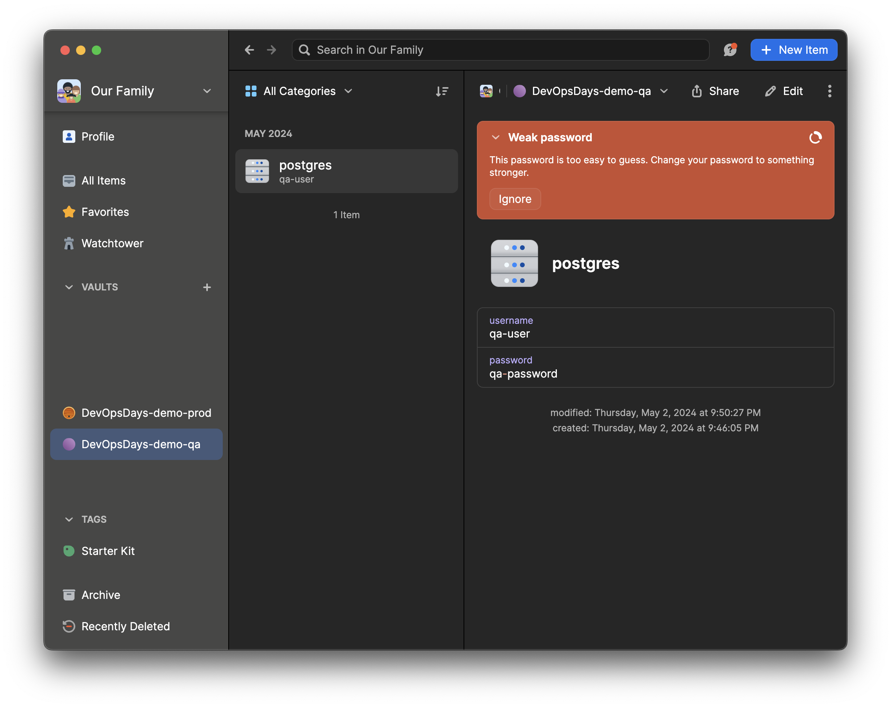
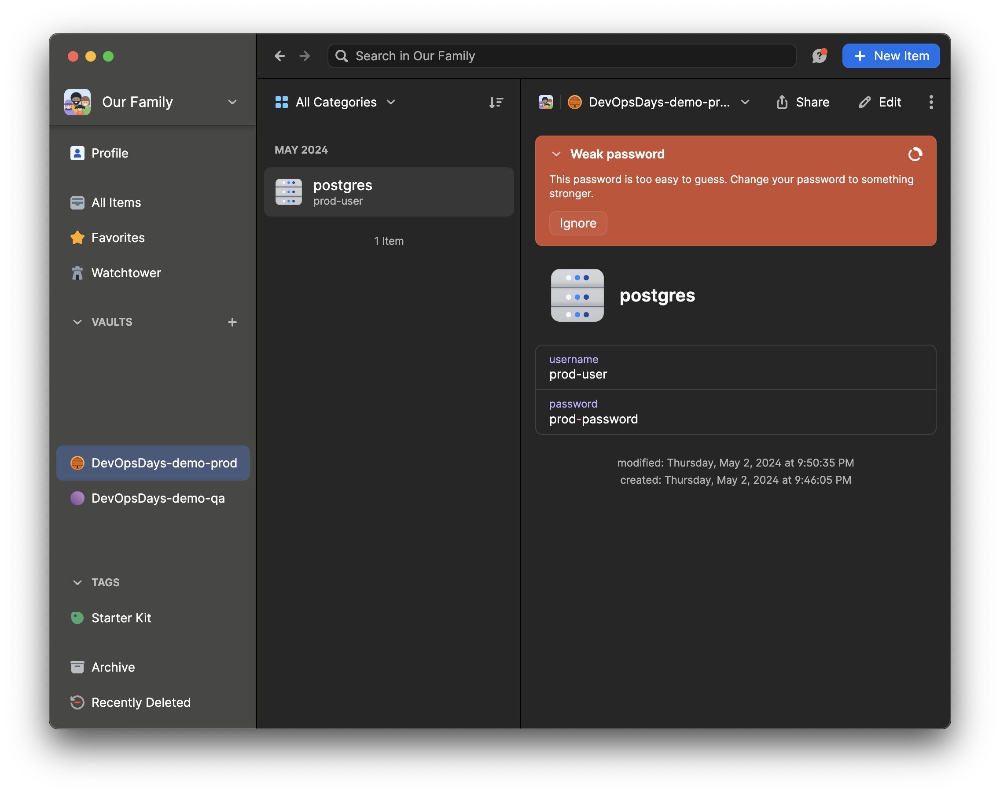

# SecretOps for StartUps using 1Password

```shell
brew install 1password-cli
```





## Environment Variables

```
TARGET_ENV=qa op run --env-file 1password.env --no-masking printenv | grep DDA
TARGET_ENV=prod op run --env-file 1password.env --no-masking printenv | grep DDA
```

## Configuration Files

```
TARGET_ENV=qa op inject -i base.json
TARGET_ENV=prod op inject -i base.json
```
